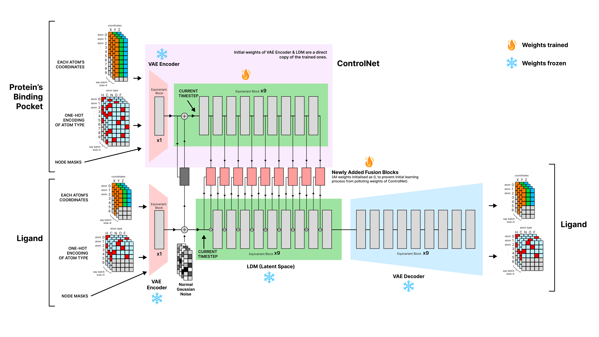

# Control-GeoLDM 🚀



This work proposes a novel approach of adopting the idea of [ControlNet (Zhang et al., 2023)](https://arxiv.org/abs/2302.05543) on Graph Diffusion Models to condition the ligand generation process of the Latent Graph Diffusion Model on target Protein Pockets of interest. Specifically, our work builts on top of [GeoLDM (Xu et al., 2023)](https://github.com/MinkaiXu/GeoLDM), [DiffSBDD (Schneuing et al., 2022)](https://arxiv.org/abs/2210.13695) and [EDM (Hoogeboom et al., 2022)](https://arxiv.org/abs/2203.17003). Hence, we would like to thank the authors for their work!

**💡 NOTE**: This repository requires CUDA to be installed on your hardware beforehand, and only supports the <code>x86_64</code> system architecture due to the [QuickVina2.1 binaries](analysis/qvina/qvina2.1) that we use for docking analysis.

</br>
</br>


# 🐳 Docker & Gradio Interface

We have containerized this repository along with the trained model weights using Docker. Specifically, our built images support both <code>CUDA 11.3</code> and <code>CUDA 11.8</code>. You may pull the images from DockerHub and skip the hustle of setting up the environment yourself. Furthermore, we have also prepared a Gradio Interface that allows for easy access of our models.

```bash
# Pulling the pre-built Docker Image
docker pull yixian02/control-geoldm:cu118

# Running the Gradio Interface
docker run --gpus all -it --rm -p 7860:7860 yixian02/control-geoldm:cu118 /bin/bash -c "source /opt/conda/etc/profile.d/conda.sh && conda activate geoldm && python -m deployment.main -u -a 0.0.0.0 -p 7860"
```

After spinning up the Gradio Interface, there are 2 ways to access the UI:
- Locally via http://localhost:7860.
- Public URL hosted by gradio for 72 hours. The URL will be in the form of <code>some-unique-id.gradio.live</code> and will be printed on the terminal when the docker image is run.

</br>

More details about setting up / building the Docker Images can be found in the <code>README.md</code> files in [deployment/docker/](deployment/docker)

</br>
</br>

# 🤗 Huggingface Spaces

We also host a copy of the Gradio Interface on Huggingface Spaces. The demo can be accessed [here](https://huggingface.co/spaces/PIEthonista/Control-GeoLDM-demo). Due to billing constraints, the demo will be paused if unused. You may contact us via email at [gohyixian456@gamil.com](mailto:gohyixian456@gmail.com) to request for the demo to be restarted should you wish to explore it. Optionally, you can also host it on your own Huggingface Space. We provide the Dockerfile to create the space as below:

```bash
# Prebuilt CUDA-11.8 Docker image
FROM yixian02/control-geoldm:cu118

# Expose the port the app will run on
EXPOSE 7860

# Give the project proper permissions
RUN chmod -R 777 .

# Start the application
CMD ["/bin/bash", "-c", "source /opt/conda/etc/profile.d/conda.sh && conda activate geoldm && python -m deployment.main -u -a 0.0.0.0 -p 7860"]
```

</br>
</br>

# 🌱 Environment

This repository requires 2 environments to operate. Please set them up as below.

Setup of the main environment as as follows (run them sequentially!):

```bash
conda create -n geoldm python=3.10.13

conda activate geoldm

conda install -c conda-forge rdkit biopython openbabel

conda install pathtools==0.1.2 -y

pip install imageio numpy==1.23.3 scipy tqdm wandb==0.13.4 msgpack rdkit matplotlib==3.5.2 matplotlib-inline==0.1.6 chardet periodictable ipykernel jupyter notebook prettytable seaborn scikit-learn==1.5.1 gdown

pip install gradio==5.9 plotly==5.24 huggingface

# Optionally, you may download PyTorch versions that works well with the CUDA version installed on your hardware.
pip install torch torchvision torchaudio
```

</br>

The second environment will specifically be created for [MGL-Tools](https://ccsb.scripps.edu/mgltools/) in python 2. This library is used to preprocess both ligand and protein pockets before performing docking analysis with QuickVina2.1. Specifically, it performs tasks like converting files from .pdb to .pdbqt (Adds change Q and torsions T to pockets), and etc. Setup of the environment is as follows:

```bash
conda create -n mgltools-python2 python=2.7 -y
conda activate mgltools-python2 
conda install -c bioconda mgltools -y
```

</br>

Lastly, you will need to allow additional permissions for the <code>QuickVina2.1 Binaries</code> in order for it to be executable.

```bash
cd analysis/qvina
chmod +x qvina2.1
cd ../..
```
</br>

If you encounter any issues while setting up the environment, you may refer [env/manual_install.md](env/manual_install.md) for more details.

</br>
</br>

# 📂 Datasets

In this work, we will be mainly using the [CrossDocked2020 (Francoeur et al., 2022)](https://pmc.ncbi.nlm.nih.gov/articles/PMC8902699/) dataset. We have pre-processed the dataset so that they are readily consumed by the scripts. You may setup and download each of them to their respective directories according to the <code>README</code> files in [data/](data)

However, if you wish to recompile the datasets according to your own needs, you may first download the raw dataset as below to any directory on your hardware. Optionally, you may refer [data_EDA/download_datasets.md](data_EDA/download_datasets.md) for instructions on downloading other optional datasets.

```bash
conda activate geoldm

# change to your custom directory
cd <?>

# download the dataset zip files
gdown --fuzzy https://drive.google.com/file/d/10KGuj15mxOJ2FBsduun2Lggzx0yPreEU/view?usp=drive_link

gdown --fuzzy https://drive.google.com/file/d/1mycOKpphVBQjxEbpn1AwdpQs8tNVbxKY/view?usp=drive_link

# unzip the zip files
tar -xzvf crossdocked_pocket10.tar.gz
```

</br>


Next, you would need to run the below in sequence to compile the raw datasets into <code>.npz</code> files. Note that you may need to alter the input and output variables of each of the scripts in order for them to work if customisation is required.

```bash
conda activate geoldm
cd data_preprocessing/CrossDocked

# compiles the raw dataset
python 01_build_crossdocked_dataset.py --raw_crossd_basedir <path-to-raw-dataset> --dist_cutoff 10.0 --save_dir data/d_20241203_CrossDocked_LG_PKT_MMseq2_split_CA_only --save_dataset_name d_20241203_CrossDocked_LG_PKT_MMseq2_split --copy_files_dir data/d_20241203_CrossDocked_LG_PKT_MMseq2_split_CA_only/test_val_paired_files --ca_only

# computes the dataset's stats & distribution to be used during training
python 02_compute_histogram.py

# OPTIONAL: stratified train,test,val split
# The original dataset is already split using the protein pockets' MMseq2 similarity.
python 03_build_data_split.py

# computes the metrics' upper bounds for reference 
python 04_compute_metric_upper_bounds.py
```

</br>

After computing the dataset's stats & distribution, they will be saved to [data_preprocessing/CrossDocked/](data_preprocessing/CrossDocked) in the format of <code>stats__d_DATE_DATASET_SPECIFICS.txt</code>. Manual work is required to transfer these information to its corresponding sections in [configs/dataset_configs/dataset_config_CrossDocked.py](configs/dataset_configs/dataset_config_CrossDocked.py)


</br>
</br>


# ⚙️ Model Configurations
Model configurations are packaged in <code>.yaml</code> files categorised accordingly in [configs/model_configs/CrossDocked](configs/model_configs/CrossDocked)

</br>
</br>


# 🏋️‍♂️ Model Training & Evaluation
We divide our model training process into 4 steps as below. Please refer each of the models' <code>.yaml</code> configuration files for the number of training runs required. Specifically, the number of resumed checkpoints will provide a quick approximation. Each of the models' training runs will be logged to [wandb.ai](http://wandb.ai)

## 1. Training & Evaluating the Ligand VAE
```bash
# training
python main_geom_drugs.py --config_file configs/model_configs/CrossDocked/20240623__10A/full/AMP/LG_Only/latest/best/AMP__01_VAE_vaenorm_True10__bfloat16__latent2_nf256_epoch100_bs36_lr1e-4_InvClassFreq_Smooth0.25_x10_h5_NoEMA__DecOnly_KL-0__20240623__10A__LG_Only.yaml

# evaluation
python eval_analyze_vae_recon_loss.py --model_path <path-to-model-weights> --load_last --data_size 1
```

</br>

## 2. Training & Evaluating the Pocket VAE
```bash
# training
python main_geom_drugs.py --config_file configs/model_configs/CrossDocked/20240623__10A/full/AMP/PKT_Only/latest/DICC/best/AMP__01_VAE_vaenorm_True10__float32__latent2_nf256_epoch100_bs12_lr1e-4_InvClassFreq_Smooth0.25_XH_x30_h15_NoEMA__20240623__10A__PKT_CA_Only.yaml

# evaluation
python eval_analyze_vae_recon_loss.py --model_path <path-to-model-weights> --load_last --data_size 1
```

</br>

## 3. Training & Evaluating the Ligand LDM
```bash
# training
python main_geom_drugs.py --config_file configs/model_configs/CrossDocked/20240623__10A/full/AMP/ldm/best/AMP__02_LDM_vaenorm_True10__float32__latent2_nf256_epoch200_bs36_lr1e-4_NoEMA__VAE_DecOnly_KL-0__20240623__10A.yaml

# evaluation
python eval_analyze_ldm.py --load_last --batch_size_gen 20 --n_samples 200 --model_path <path-to-model-weights>
```

</br>

## 4. Training & Evaluating the ControlNet
```bash
# training
python main_geom_drugs_control.py --config_file configs/model_configs/CrossDocked/20240623__10A/full/AMP/controlnet/tmp_done/03_latent2_nf256_ds1k_fusReplace_CA__epoch1k_bs60_lr1e-4_NoEMA__20241203__10A.yaml

# OPTIONAL: you may fine-tune the Ligand LDM, ControlNet & Fusion Blocks to enhance performance if required
python main_geom_drugs_control.py --config_file configs/model_configs/CrossDocked/20240623__10A/full/AMP/controlnet/FT_03_latent2_nf256_ds1k_fusReplace_CA__epoch1k_bs60_lr1e-4_NoEMA__20241203__10A.yaml

# evaluation
python eval_analyze_controlnet.py --model_path <path-to-model-weights> --load_last --pocket_pdb_dir data/d_20241203_CrossDocked_LG_PKT_MMseq2_split_CA_only/test_val_paired_files/val_pocket --num_samples_per_pocket 10 --delta_num_atoms 5 --batch_size 512 --seed 42 --cleanup_files --ligand_add_H --receptor_add_H
```

</br>

**NOTE**: You may refer the <code>slurm job</code> submission files in [slurm/CrossDocked](slurm/CrossDocked) for the resources allocated for each model's training and evaluation run.
